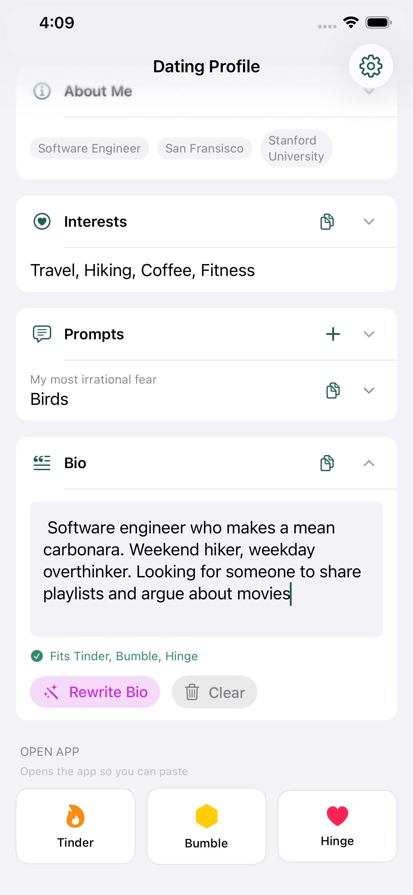
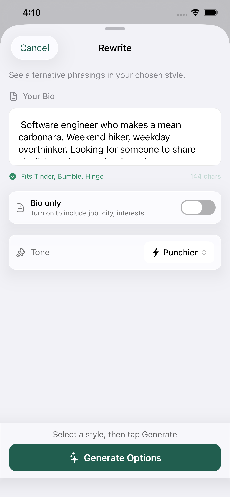

# Dating Profile Vault

  

  <strong>Craft & Copy Perfect Bios</strong> 
  Support page and privacy policy for the Dating Profile Vault iOS app.

  
  
  

## About the App

Dating Profile Vault helps you create, manage, and optimize your dating profile content. Write your bio once, refine it with AI, and copy it to any dating app.

**Features:**
- Store bios, interests, and prompt answers in one place
- AI-powered rewrites using Apple Intelligence (on-device)
- One-tap copy formatted for Tinder, Bumble, Hinge
- All data stored locally - no accounts, no cloud sync

## Links

- [Support Page](https://spicyintelchip.github.io/DatingProfileVault/)
- [Privacy Policy](https://spicyintelchip.github.io/DatingProfileVault/privacy.html)
